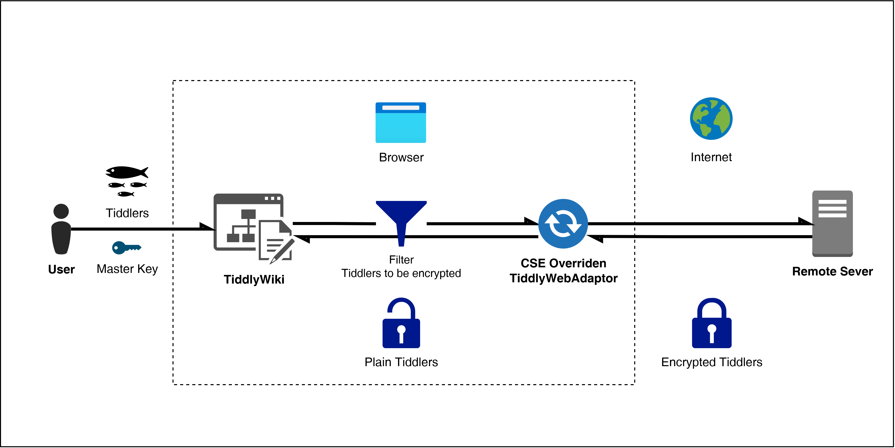

<div align="center">

# TW5-CSEncryption

Client-Side Encryption for [TiddlyWiki5](https://tiddlywiki.com) on Node.js

</div>

## Features

- Configure a master password for TiddlyWiki5 on Node.js, and automatically encrypt tiddlers once it leaves the browser.
- Compatible with and interacts with [EncryptTiddler](https://github.com/danielo515/TW5-EncryptTiddlerPlugin), supports using [EncryptTiddler](https://github.com/danielo515/TW5-EncryptTiddlerPlugin) for encryption again internally, and the encrypted file can be decrypted using [EncryptTiddler](https://github.com/danielo515/TW5-EncryptTiddlerPlugin).
- Use the same encryption library as [EncryptTiddler](https://github.com/danielo515/TW5-EncryptTiddlerPlugin), which is the [SJCL](https://crypto.stanford.edu/sjcl/) built into TW5, and the default encryption method is AES-CCM 128.
- Supports modifying and clearing passwords, supports modifying Filters, and instantly pushes the changes to the server.

## Architecture Overview



## Documentation

For more information, please see: [TW5-CSEncryption — Client-Side Encryption for TiddlyWiki5 on Node.js](https://fspark.github.io/TW5-CSEncryption/ "TW5-CSEncryption — Client-Side Encryption for TiddlyWiki5 on Node.js")

## Development

```
git clone https://github.com/FSpark/TW5-CSEncryption
cd TW5-CSEncryption
pnpm i

# Since I modified the scaffolding (gulp-tw) myself but didn't publish it to NPM, please install the dependencies like this:

cd <another_folder>
git clone https://github.com/FSpark/gulp-tw
cd TW5-CSEncryption
pnpm link <another_folder>/gulp-tw
pnpm run dev

# Enjoy :)
```


